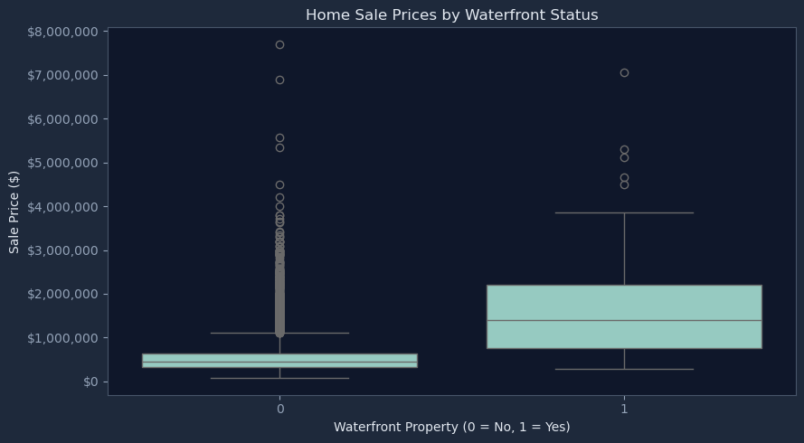
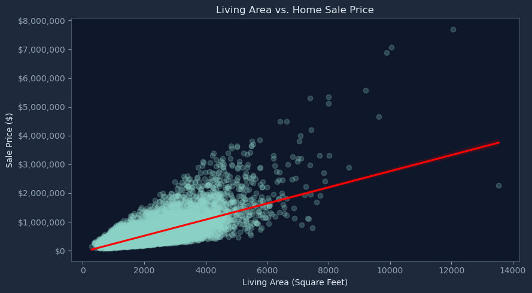

# King County Housing Price Prediction

**Exploring what influences home prices and using machine learning to estimate property values.**

## Overview

What makes one home more expensive than another? Is it the size, location, condition, or a combination of several factors?

This project explores those questions using data from **21,613 residential property sales in King County, Washington**, including the Seattle area.

Using Python and machine learning, I analyzed housing characteristics, explored relationships between property features and sale prices, and compared regression models to see how well they could estimate home values.

## Dataset

The dataset contains homes sold between **May 2014 and May 2015**, with information about each property's sale price and characteristics.

Some of the features explored include:

- **Property size:** Living area, lot size, and number of floors
- **Home features:** Bedrooms, bathrooms, and overall condition
- **Location:** Geographic coordinates, ZIP codes, and waterfront status
- **Property history:** Construction and renovation years

The goal was to understand which characteristics were most closely associated with housing prices and use those features to build predictive models.

## Exploring the Data

Before building the models, I explored the dataset to better understand the properties and prepare the information for analysis.

This included identifying missing values, removing unnecessary columns, examining property characteristics, and visualizing relationships between housing features and sale prices.

### Waterfront Properties and Sale Prices

To explore how location-related features affect housing prices, I compared sale prices for waterfront and non-waterfront properties.

### What Influences Housing Prices?

Several property characteristics showed strong positive relationships with sale prices:

| Property Feature | Correlation with Price |
|---|---:|
| Living area | 0.702 |
| Property grade | 0.667 |
| Above-ground square footage | 0.606 |
| Nearby homes' living area | 0.585 |

**Key takeaway:** Larger homes and properties with higher construction grades generally tended to have higher sale prices in this dataset.

## Building the Prediction Models

To estimate housing prices, I explored several regression techniques, starting with simpler models and then introducing additional features and complexity.

The approaches included:

- **Linear Regression:** Estimating prices from individual or multiple property characteristics
- **Ridge Regression:** Applying regularization to a model using multiple housing features
- **Polynomial Regression:** Capturing more complex relationships between property characteristics and sale prices

The final evaluations used **85% of the data for training and 15% for testing**, allowing the models to be assessed on properties outside their training data.

## Model Performance

The models were compared using **R²**, a metric that measures how much of the variation in home prices a model can explain. A higher R² generally indicates a better fit.

| Model | Test R² |
|---|---:|
| Ridge Regression | 0.648 |
| Polynomial Ridge Regression (Degree 2) | **0.704** |
| Polynomial Ridge Regression (Degree 3) | 0.516 |

**Best result: R² = 0.704**

The second-degree Polynomial Ridge Regression model performed best on the test data, explaining approximately **70.4% of the variation in sale prices**.

Interestingly, increasing the polynomial degree to three reduced performance. This highlights an important lesson in predictive modeling: a more complex model does not necessarily make better predictions on new data.

## Technologies Used

- **Python** — Data analysis and modeling
- **Pandas & NumPy** — Data preparation and manipulation
- **Matplotlib & Seaborn** — Data visualization
- **scikit-learn** — Regression models, feature transformations, and evaluation
- **Jupyter Notebook** — Interactive analysis and experimentation

## Skills Demonstrated

- Data cleaning and preparation
- Exploratory data analysis and visualization
- Correlation analysis
- Feature selection and transformation
- Linear and polynomial regression
- Model evaluation and comparison
- Interpreting machine learning results

## Project Context

This project was completed as part of the **IBM Data Science Professional Certificate**, providing hands-on experience with housing market analysis and regression modeling.

The work demonstrates foundational machine learning and data analysis techniques using a real-world housing dataset.
